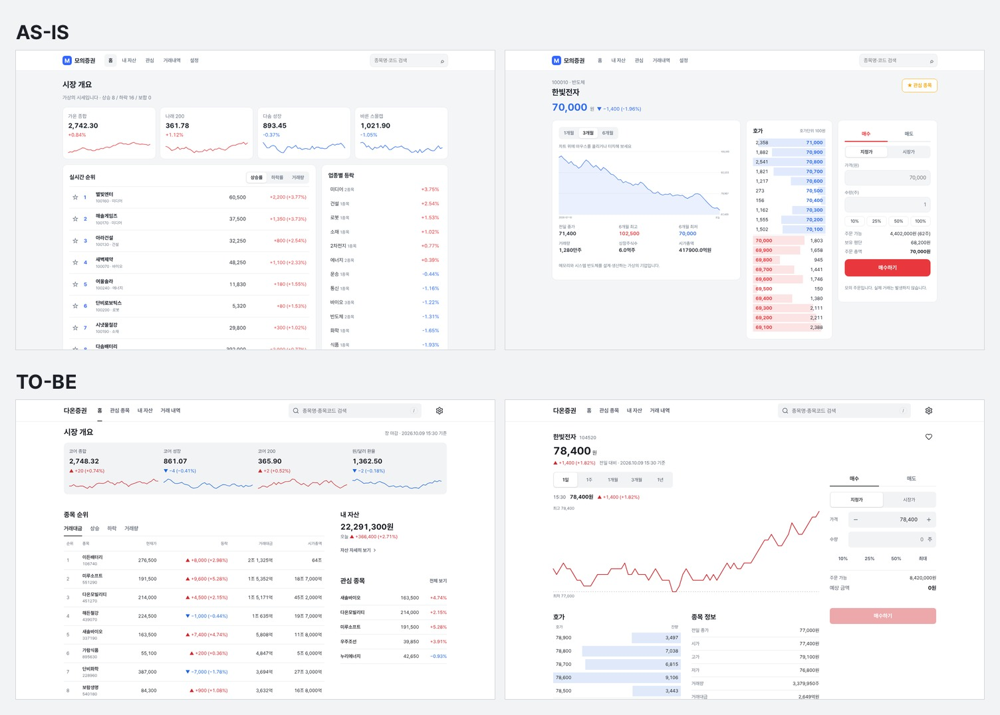

<div align="center">

# suta

An agent skill that fixes the parts of a UI that look AI-made.<br>
Install it in Claude Code or Codex, and they read it every time they build UI.

[](https://github.com/Guksu/suta/actions/workflows/deploy-demo.yml)


[](LICENSE)

[**Live demo**](https://guksu.github.io/suta/) · [Full guide](docs/guide.en.md) · [한국어](README.md)

</div>

## AS-IS / TO-BE

We gave Claude Code the requests below. One side had nothing installed. The other side had only suta installed. Model and settings were the same.

### Mobile webview: e-commerce

> Build the e-commerce screens for a mobile webview: home, product list, product detail, my page, cart, settings, and a GNB (bottom navigation). *(Translated from the original Korean request.)*


From left: home, product list, product detail, cart, my page, settings. Captured at 390px wide. The food photos are credited in [Image credits](docs/assets/CREDITS.md).

We ran it once without suta and four times with suta 0.8. The bottom row is the third of the four runs. The table compares the two rows in the image.

| | AS-IS (without suta) | TO-BE (with suta) |
|---|---|---|
| Color | Orange on the banner, categories, badges, stars and buttons | One brown accent. Only the discount rate is red |
| Icons | Emoji | Line icons of one size and stroke |
| Product cards | Orange BEST, NEW and "popular" pills | Discount rate, price and rating only |
| Home | No way to search | A search field at the top |
| Detail bottom bar | Four controls: wish, quantity, add to cart, buy | Wish and Buy. Options and quantity are picked in a sheet that opens from Buy |
| Bottom tabs (GNB) | Cart is a tab, so the cart screen pins both the tab bar and the order button | Cart is an icon in the header. Tabs are hidden on detail and cart |
| Accessibility violations (axe, 6 screens) | 111 color-contrast issues | 0 |

All four suta runs had the home search field, the cart in the header, tabs hidden on detail and cart, the purchase sheet and one set of line icons. Three of the four used a dark green accent instead of brown, and axe found 0 to 2 violations per run. Build time went from 2.3 minutes to 5 to 7 minutes. Method and per-run results are in the [mobile webview e-commerce study](docs/research/2026-10-08-commerce-webview.md) (Korean).

### Desktop: stock trading website

> Build a stock trading platform website. It needs home (market overview), stock detail (chart, order book, order), my assets, watchlist, search, trade history, settings and a GNB. *(Translated from the original Korean request.)*



Left is the home screen, right is the stock detail screen. Both are the first screen at 1440px wide. The stock names and prices are made-up data.

We ran it four times without suta and twice with suta 0.10. The image shows the first run of each condition. The table covers all 7 screens.

| | Without suta (4 runs) | With suta 0.10 (2 runs) |
|---|---|---|
| Accessibility violations (axe, 1440px) | 63 to 277, mostly color contrast | 0 |
| Rising-price red | `#e8383d` and similar, 4.1:1 on white | `#d0262d`, 4.5:1 or more |
| Order button within the first screen | 2 of 4 runs | Both runs |
| Search field in the header | All 4 runs | Both runs (with a `/` shortcut hint) |
| Fixed sell/buy bar on the mobile stock detail | None | Both runs |
| Build time and cost | 3 to 4.4 minutes, $0.54 to $0.75 | 7.4 to 14.5 minutes, $1.51 to $1.72 |

For each screen we showed a model the two results without labels and asked which was better. There were 14 pairs, each judged twice with the order swapped, so 28 judgments per judge. The judge that is the same model that built the pages picked suta 23 times. A different model picked suta 24 times. Only the search screen was split 2:2. With just 14 pairs, these numbers do not generalize far.

On the first try with suta 0.9, contrast was already fine, but the order panel sat below the first screen and the header had no search field. Version 0.10 added conventions taken from 10 stock trading websites. Method and per-run results are in the [stock trading website study](docs/research/2026-10-09-securities-web.md) (Korean).

## How it works

suta has three parts.

1. The entry skill (`skills/suta/SKILL.md`) is what the agent reads on every UI request. It holds the order of work, the things not to do, and the spacing, type and color values.
2. The 56 patterns (`skills/suta/patterns/`) are docs and code for UI such as a bottom sheet, bottom tabs or toasts. The agent picks the ones it needs and copies the code into the project. They have no runtime dependencies.
3. The post-edit check runs only when suta is installed as a plugin. It runs layout and motion checks every time a file is edited, and the agent gets back only the problems on the lines it just changed.

The instructions and pattern docs are written in Korean. You can still ask in English. In a single check with the request "Build a settings screen for a mobile web app", Claude Code loaded suta, built the screen with English copy, fixed the one warning from the post-edit check and answered in English.

The name comes from the Korean *suta* (手打), "hand-made", as in noodles pulled by hand instead of pressed by a machine.

## Installation

Claude Code:

```text
/plugin marketplace add Guksu/suta
/plugin install suta@suta
```

In Codex, approve suta's post-edit check in `/hooks` after installing.

```bash
codex plugin marketplace add Guksu/suta
codex plugin add suta@suta
```

Other agents such as Cursor, Gemini CLI and GitHub Copilot install the skill only. The post-edit check does not run there.

```bash
npx skills add Guksu/suta --skill suta
```

The install script, install folders and moving from the old version are in the [full guide, "Installation"](docs/guide.en.md#installation).

## Usage

Ask as you normally would. Say "build a login screen" or "polish this button animation", and the agent reads suta and picks the patterns that fit.

You can try the 56 patterns in the [live demo](https://guksu.github.io/suta/). The list is in the [full guide](docs/guide.en.md#56-patterns).

## Benchmark

We wrote requests for 8 screen types (detail, form, settings, dashboard, landing, cart, list, interaction) and gave each to both sides twice. The resulting pages were measured in a browser. Below is round 2, measured with suta 0.6.0.

| 16 pages (lower is better) | Plain Claude Code | With suta |
|---|---|---|
| Accessibility violations (axe, total) | 87 | 13 |
| Boxes nested in boxes (total) | 41 | 1 |
| Gradients, blurs, large shadows (total) | 47 | 0 |
| Touch targets under 24px (total) | 27 | 0 |
| Pages with text under 12px | 4 | 0 |
| Pages that scroll sideways at 320px | 2 | 0 |
| Pages whose primary button is blue, indigo or violet | 10 | 0 |

On the suta side the most-used text size is 16px. That matches the median of reference websites measured the same way.

We also showed a model the two pages without labels and asked which was better, with "tie" as an option. The judge that is the same model that built the pages picked suta 11 times out of 32. A different model picked suta 19 times. There were no ties. The two judges disagree, so these numbers do not say which side looks better.

The median time per page went from 61 to 103 seconds. Method, the judges' reasons and limitations are in the [benchmark doc](docs/benchmark.en.md).

## What it prevents

AI slop is output that looks AI-made. suta makes the agent keep to the rules below and reuse code from 56 patterns whenever it builds UI.

| What AI often builds | With suta |
|---|---|
| Every screen on the same template, every section in a card | Each screen type starts from its own skeleton. Groups are made with spacing and thin lines |
| Random spacing, type and radius values, 9px text | Values come only from tokens (scales). Text is 12px or larger |
| The framework's default blue as the accent, and a pastel per status | One accent plus error red |
| Gradients, badges and filled buttons everywhere | Emphasis in one or two places per screen |
| Emoji as icons | One set of line icons with the same size and stroke |
| `transition: all`, animating height | Only `transform` and `opacity` move, with durations sized to the motion |
| Keyboard, screen readers and reduced motion ignored | Every pattern supports accessibility and reduced motion |

The full list is in the [full guide, "What it removes"](docs/guide.en.md#what-it-removes).

## Limitations

- Each comparison ran only once or twice per condition. Running the same condition again changes the screen structure.
- The rule values come from 1,104 screens of 31 Korean apps and 19 reference websites. Conventions elsewhere may differ.
- The agent reads more, so it takes longer and costs more. In the e-commerce test, 2.3 minutes and $0.39 became 5 to 7 minutes and $1.35 to $1.55.
- The agent never sees the screens it builds. Static checks cannot catch bugs that only show when rendered, such as a component that never loads its styles or a button that does not respond.
- All tests used the default model of Claude Code only.

## Learn more

- [Full guide](docs/guide.en.md): every install option, how it works, the post-edit check, 56 patterns, development and contributing
- [Benchmark](docs/benchmark.en.md): method, all metrics and the judges' reasons for plain Claude Code vs suta
- [Agent instructions](AGENTS.md) (Korean): for coding agents working in this repository
- Research (Korean): [Layout principles](docs/research/2026-10-06-layout-principles.md) · [Screen conventions](docs/research/2026-10-07-screen-conventions.md) · [Color count and AI chat](docs/research/2026-10-08-chat-color.md) · [Mobile webview e-commerce](docs/research/2026-10-08-commerce-webview.md) · [Stock trading website](docs/research/2026-10-09-securities-web.md)

## License

The code is [MIT](LICENSE) (© 2026 Guksu). Licenses for the photos in the README comparison image are in [Image credits](docs/assets/CREDITS.md).
