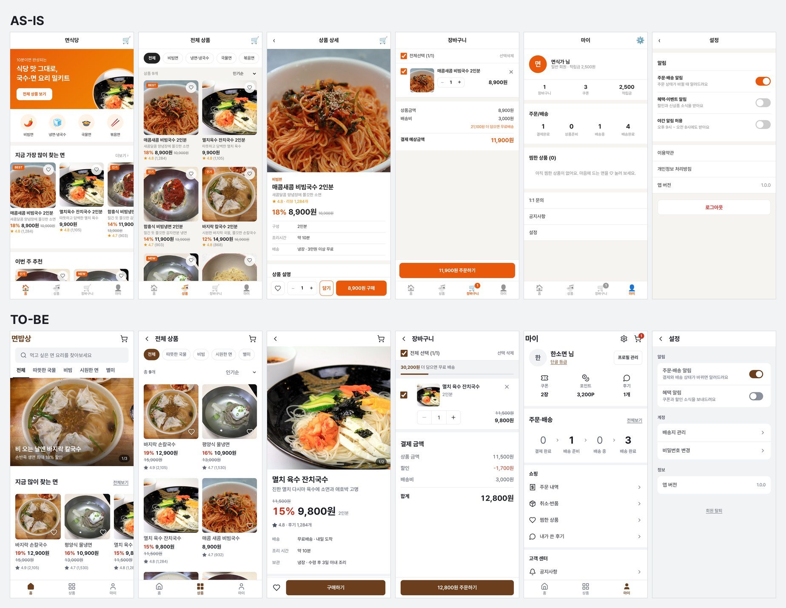

<div align="center">

# suta

AI가 만든 티가 나는 UI를 고치는 에이전트 스킬입니다.<br>
Claude Code나 Codex에 설치해 두면 UI를 만들 때마다 이 스킬을 읽습니다.

[](https://github.com/Guksu/suta/actions/workflows/deploy-demo.yml)


[](LICENSE)

[**라이브 데모**](https://guksu.github.io/suta/) · [상세 안내](docs/guide.md) · [English](README.en.md)

</div>

## AS-IS / TO-BE

아래 요청을 Claude Code에 두 번 맡겼습니다. 한 번은 아무것도 설치하지 않았고, 한 번은 suta만 설치했습니다. 모델과 설정은 같습니다.

> 모바일 웹뷰에 사용하는 이커머스 화면들을 구현해줘. 홈 / 상품 리스트 / 상품 상세 / 마이 페이지 / 장바구니 / 설정 / GNB가 있어야 해



왼쪽부터 홈, 상품 리스트, 상품 상세, 장바구니, 마이, 설정입니다. 390px 폭에서 찍었습니다. 음식 사진의 출처는 [이미지 출처](docs/assets/CREDITS.md)에 있습니다.

| | AS-IS (suta 없이) | TO-BE (suta 설치) |
|---|---|---|
| 색 | 주황을 배너·카테고리·배지·별점·버튼에 씀 | 갈색 강조색 하나. 할인율만 빨강 |
| 아이콘 | 이모지 | 같은 크기·같은 굵기의 선 아이콘 |
| 상품 카드 | BEST·NEW·인기 주황 알약 | 할인율, 가격, 별점만 |
| 홈 | 검색 입구가 없음 | 맨 위에 검색창 |
| 상세 하단 바 | 찜, 수량, 담기, 구매 버튼 4개 | 찜과 구매하기. 옵션과 수량은 구매하기를 누르면 올라오는 시트에서 고름 |
| 하단 탭(GNB) | 장바구니가 탭이라, 장바구니 화면에 탭과 주문 버튼이 함께 고정됨 | 장바구니는 머리 오른쪽 아이콘. 상세와 장바구니에서는 탭을 숨김 |
| 접근성 위반(axe, 6화면) | 색 대비 111곳 | 0곳 |

실험 방법과 다른 실행의 결과는 [모바일 웹뷰 이커머스 연구](docs/research/2026-10-08-commerce-webview.md)에 있습니다.

## 벤치마크

화면 종류 8개(상세·폼·설정·대시보드·랜딩·장바구니·목록·인터랙션)의 요청을 두 쪽에 두 번씩 맡겼습니다. 만든 화면은 브라우저로 열어 쟀습니다. 아래는 글자·색·면 기준을 더한 뒤의 2차 결과입니다.

| 화면 16개 (낮을수록 좋음) | 일반 Claude Code | suta 설치 |
|---|---|---|
| 접근성 위반 (axe, 합계) | 87 | 13 |
| 상자 안 상자 (합계) | 41 | 1 |
| 그라데이션·흐림·큰 그림자 (합계) | 47 | 0 |
| 24px 미만 터치 영역 (합계) | 27 | 0 |
| 12px 미만 글자가 있는 화면 | 4 | 0 |
| 320px에서 가로로 넘친 화면 | 2 | 0 |
| 주 버튼이 파랑·남색·보라 계열인 화면 | 10 | 0 |

suta 쪽에서 가장 많이 쓴 글자 크기는 16px입니다. 같은 방법으로 잰 레퍼런스 웹사이트의 중앙값과 같습니다.

모델에게 두 화면을 이름 없이 보여 주고 더 나은 쪽을 고르게 했습니다. 32번 중 suta를 고른 횟수는 판정 모델에 따라 11번과 19번이었습니다.

화면 하나를 만드는 시간은 중앙값 61초에서 103초로 늘었습니다. 방법, 판정 이유, 한계는 [벤치마크 문서](docs/benchmark.md)에 있습니다.

## 무엇을 막나

AI 슬롭은 AI가 만든 티가 나는 결과물을 말합니다. suta는 에이전트가 UI를 만들 때 아래 금지선을 지키고, 패턴 56종의 코드를 가져다 쓰게 합니다.

| AI가 흔히 만드는 UI | suta를 쓰면 |
|---|---|
| 모든 화면이 같은 틀이고, 모든 섹션이 카드다 | 화면 유형마다 정해진 뼈대에서 시작하고, 간격과 얇은 선으로 묶는다 |
| 간격·글자·반경 값이 제각각이고, 9px 글자가 있다 | 값은 토큰(척도)에서만 고르고, 글자는 12px 이상이다 |
| 강조색이 프레임워크 기본 파랑이고, 상태마다 연노랑·주황·연두를 칠한다 | 강조색 하나와 오류 빨강만 쓴다 |
| 그라데이션·배지·채운 버튼이 곳곳에 있다 | 강조는 화면마다 한두 곳이다 |
| `transition: all`을 붙이고 높이를 움직인다 | `transform`·`opacity`만 움직이고, 시간은 움직이는 크기에 맞춘다 |
| 키보드·스크린 리더·동작 줄이기 설정을 무시한다 | 모든 패턴이 접근성과 동작 줄이기에 대응한다 |

전체 목록은 [상세 안내의 "무엇을 없애나"](docs/guide.md#무엇을-없애나)에 있습니다.

## 설치

Claude Code:

```text
/plugin marketplace add Guksu/suta
/plugin install suta@suta
```

Codex는 설치한 뒤 `/hooks`에서 suta의 편집 후 검사를 승인합니다.

```bash
codex plugin marketplace add Guksu/suta
codex plugin add suta@suta
```

Cursor, Gemini CLI, GitHub Copilot 같은 다른 에이전트에는 스킬만 설치합니다.

```bash
npx skills add Guksu/suta --skill suta
```

설치 스크립트, 설치 폴더, 예전 버전에서 옮기는 방법은 [상세 안내의 "설치"](docs/guide.md#설치)에 있습니다.

## 쓰는 법

평소처럼 요청하면 됩니다. "로그인 화면 만들어줘"나 "이 버튼 애니메이션 다듬어줘"라고 하면, 에이전트가 suta를 읽고 맞는 패턴을 고릅니다.

플러그인으로 설치하면 파일을 고칠 때마다 레이아웃·모션 검사가 돕니다. 에이전트는 방금 바꾼 줄의 문제만 돌려받습니다. 자세한 내용은 [편집 후 검사](docs/guide.md#편집-후-검사)에 있습니다.

패턴 56종은 [라이브 데모](https://guksu.github.io/suta/)에서 직접 만져 볼 수 있습니다. 목록은 [상세 안내](docs/guide.md#패턴-56종)에 있습니다.

## 더 알아보기

- [상세 안내](docs/guide.md): 설치 방법 전체, 동작 방식, 편집 후 검사, 패턴 56종, 개발과 기여
- [벤치마크](docs/benchmark.md): 일반 Claude Code와 suta를 비교한 방법, 전체 지표, 판정 이유
- [에이전트 작업 지침](AGENTS.md): 이 저장소에서 일하는 코딩 에이전트용
- 연구: [레이아웃 원칙](docs/research/2026-10-06-layout-principles.md) · [화면 유형별 관례](docs/research/2026-10-07-screen-conventions.md) · [색의 수와 AI 채팅](docs/research/2026-10-08-chat-color.md) · [모바일 웹뷰 이커머스](docs/research/2026-10-08-commerce-webview.md)

## 라이선스

코드는 [MIT](LICENSE)입니다(© 2026 Guksu). README 비교 이미지의 사진 라이선스는 [이미지 출처](docs/assets/CREDITS.md)에 있습니다.
