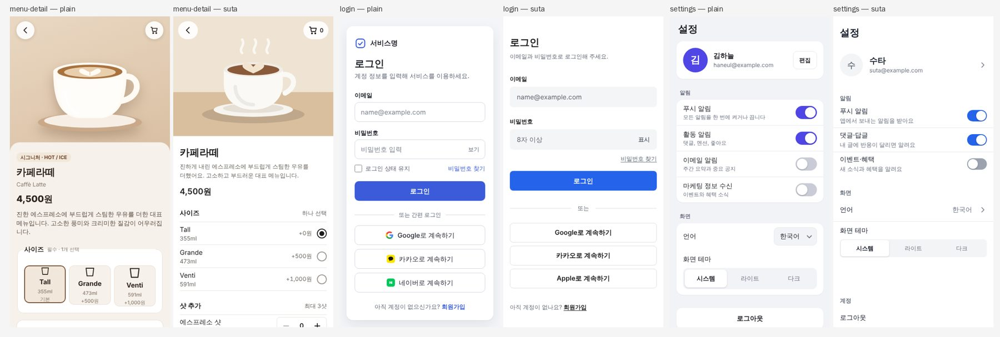

# Publishing benchmark — plain Claude Code vs suta

We gave the same requests, word for word, to two Claude Code setups and measured the resulting pages in a real browser.

- **Plain**: Claude Code with nothing installed
- **suta**: Claude Code with only the suta plugin installed (entry skill + post-edit check hook)

Model, settings and tool permissions are identical. The only difference is the plugin.

한국어: [benchmark.md](benchmark.md)

## Results (2026-10-07 · 16 pages per condition)

### At a glance

- **suta's pages had far fewer defects.**
  - Accessibility violations (axe) across the 16 pages fell from 87 to 4. 81 of the plain side's 87 were insufficient text contrast.
  - Boxes nested in boxes (41 → 0), gradients, blurs and large shadows (47 → 0) and touch targets under 24px (27 → 0) all went to zero.
  - Pages with text under 12px (4 → 0) and pages that scroll sideways at 320px (2 → 0) also went to zero.
  - Distinct font sizes per page halved, from 8.1 to 4.1.
- **Some things did not differ.** Neither side used `transition: all`. On the plain side, 14 of the 15 pages with motion already supported reduced motion.
- **The blind judgment picked the plain side more often.** Out of 32 judgments, the default judge model chose plain 25 times, and a different judge model 18 times.
  - The most common reason suta lost was "clean but plain" (see [Why the judges chose](#why-the-judges-chose) below).
  - suta won when the plain page had a visible defect, such as a broken bar chart or a headline split mid-word (dashboard, landing).
- **It costs more.**
  - Time per page went from a median of 61 to 96 seconds.
  - Input tokens were 4.3× and output tokens 1.5×, because the agent reads the skill and pattern docs and runs the checks.



### All metrics

| Metric (lower is better) | Plain Claude Code | With suta |
|---|---|---|
| Pages that scroll sideways at 320px | 2/16 | 0/16 |
| Pages where a fixed bottom bar still covers content at the end | 0/16 | 0/16 |
| Pages with text under 12px | 4/16 | 0/16 |
| Touch targets under 24px (16-page total) | 27 | 0 |
| Boxes nested in boxes (16-page total) | 41 | 0 |
| Gradients, blurs, large shadows (16-page total) | 47 | 0 |
| Distinct font sizes (per page) | 8.1 | 4.1 |
| Centered multi-line paragraphs (16-page total) | 3 | 0 |
| Pages using `transition: all` | 0/16 | 0/16 |
| Pages animating width, height, position or margins directly | 1/16 | 0/16 |
| Pages with motion but no reduced-motion support | 1/16 | 0/16 |
| Accessibility violations (axe, 16-page total) | 87 (87 serious) | 4 (4 serious) |
| suta audit errors · warnings (per page) ※ | 0.1 · 5.9 | 0 · 0.1 |
| Card-like boxes (16-page total) † | 126 | 27 |
| Pages opening height via grid tracks (`grid-template-rows`) † | 0/16 | 5/16 |

※ suta's own standard, shown for reference only.

† More or fewer is not better or worse by itself (descriptive).
- Card-like boxes show a difference in how content is grouped.
- The grid-track technique is what suta recommends instead of animating height. It still recalculates layout every frame, just like animating height. The one plain-side case animated `width` and `max-height` directly.

### Judgment results

| Request | Default judge model (suta : plain) | Different judge model (suta : plain) |
|---|---|---|
| Detail `menu-detail` | 2 : 2 | 2 : 2 |
| Login `login` | 0 : 4 | 0 : 4 |
| Settings `settings` | 0 : 4 | 0 : 4 |
| Dashboard `dashboard` | 2 : 2 | 4 : 0 |
| Landing `landing` | 1 : 3 | 4 : 0 |
| Cart `cart` | 0 : 4 | 0 : 4 |
| Search results `search-results` | 0 : 4 | 2 : 2 |
| Bottom sheet `option-sheet` | 2 : 2 | 2 : 2 |
| **Total** | **7 : 25** | **14 : 18** |

Each pair was judged twice with the order swapped, so there are 4 judgments per request (2 runs × 2 orders). Pairs where both orders picked the same side: 15 of 16 for the default judge (plain 12, suta 3) and 14 for the different judge (plain 8, suta 6).

### Why the judges chose

Collecting the one-sentence reasons the judges gave:

- **Reasons for choosing plain**
  - The settings page grouped sections in cards on a gray background, so the areas were distinct (suta divided them with lines only — "flat").
  - Social login buttons had brand colors and icons (suta's were identical white buttons).
  - Links such as "forgot password" were blue and looked like links (suta's were gray text).
  - More features, such as select-all and delete-selected in the cart.
  - On desktop, the mobile column sat in a centered frame on a gray background (suta left a narrow column alone on white).
- **Reasons for choosing suta**
  - The plain page had finishing defects: a bar chart that did not draw, wrapped axis labels, a headline split mid-word, a section title running into a card border, bullets hanging outside the margin.
  - suta's left alignment and spacing were consistent, and the key figure was the largest element.

### Skill usage

- All 16 suta runs read the skill. The requests never mentioned suta.
- The most-read patterns were `layout-principles` and `motion-principles` (13 runs each), `quantity-stepper` (6) and `toast-stack` (4).
- The post-edit hook returned warnings 6 times and never blocked on an error.
- No tool call was denied for permissions in either condition.

### Interpretation — what suta should fix

Reducing defects (accessibility, narrow screens, small text, nested boxes, effect overuse) worked as intended. Most losses in the judgment came from taking things out too far. Candidates for the next improvement:

- Screens with many groups, such as settings, conventionally use inset grouped lists on a gray background — make them an exception to "boxes are the last resort".
- Buttons with brand guidelines (social login) are an exception to "emphasis in one or two places".
- Links should look like links (color or underline).
- When a single mobile column sits on a wide screen, show its edges with a background and frame.
- Taking things out means decoration, not features.

## Method

### Eight requests

One per screen type, written the way people usually ask (in Korean). The full text is in [`evals/benchmark/prompts.json`](../evals/benchmark/prompts.json).

| id | Screen type | Request (summary) |
|---|---|---|
| `menu-detail` | Detail | Cafe app menu detail — photo, name and price, size and shot options, quantity, add-to-cart button |
| `login` | Form | Login — email and password, three social logins, sign-up and password reset links, error state |
| `settings` | Settings | App settings — profile, notification toggles, language and theme, log out and delete account |
| `dashboard` | Dashboard | Seller dashboard — key metrics, recent orders, weekly sales bar chart, responsive |
| `landing` | Landing | Scheduling SaaS landing page — hero, three features, three pricing tiers, FAQ, footer |
| `cart` | Cart | Shopping cart — items (quantity, remove), coupon, payment summary, order button |
| `search-results` | List | Restaurant search results — search bar, filter chips, result list, empty state |
| `option-sheet` | Interaction | Option bottom sheet (drag to dismiss) and an added-to-cart toast, with natural animation |

Every request ends with the same sentence: "Make it a single index.html in the current folder, with CSS and JS inside, and no external libraries, CDNs or image files." This lets us measure every output under the same conditions.

### Runs

- Each request ran twice per condition (8 × 2 × 2 = 32 runs). Every run starts as a new session in an empty folder.
- Runs used `claude -p` (non-interactive). File writes were auto-approved inside the work folder, and all shell commands were allowed — the same as a person sitting next to it approving them. Non-interactive mode has nobody to approve, so anything not allowed is simply denied. Both conditions are the same.
- The suta condition loaded the plugin with `--plugin-dir`, in the same layout a marketplace install uses (manifest + `skills/`), and the plugin folder was made readable (`--add-dir`). The requests never mention suta — whether the skill triggers on its own is part of what we measure.
- Tool calls denied for lack of permission were recorded for every run. A first attempt allowed only read-only shell commands, and the suta runs ended without being able to read the pattern docs or run the checker. All 32 runs were redone with the settings above.

### Measurements

Each output (`index.html`) was opened in Chromium and measured from rendered values. The measuring code is separate from suta's checker.

| Metric | How it is measured |
|---|---|
| Sideways scroll at 320px | Whether the document scrolls horizontally at 320px wide |
| Text under 12px | Computed font size of elements that hold text directly, at 390px |
| Touch targets under 24px | Links, buttons and inputs whose shorter side is under 24px (links inside sentences excluded; checkboxes and radios include their label) |
| Card-like boxes | Elements with rounded corners plus a border, a background different from their surroundings, or a shadow. Buttons, inputs, images, anything smaller than 48×32px, circles and pills, and elements named as controls (avatars, chips, toggles, segments and so on) are excluded. More or fewer is not better or worse by itself, so this is descriptive only |
| Boxes nested in boxes | Card-like boxes sitting inside another card-like box |
| Gradients, blurs, large shadows | Elements with a large gradient background, `backdrop-filter`, a shadow blurred 16px or more, or gradient text |
| Distinct font sizes | Number of distinct computed sizes among visible text |
| Centered paragraphs | Text blocks of two or more lines that are center-aligned |
| `transition: all` | Whether any element has a computed `transition-property` of `all` with a non-zero duration |
| Layout animation | Whether any transition or `@keyframes` animates width, height, position or margins |
| Reduced-motion support | Whether a page with motion has a `prefers-reduced-motion` rule (CSS or script) |
| Accessibility violations | [axe-core](https://github.com/dequelabs/axe-core) 4.14 — WCAG 2.0, 2.1 and 2.2 A and AA rules. Serious and critical impacts are counted separately |
| suta audit | suta's own layout and motion check (`skills/suta/scripts/audit.mjs`) on the same file. This is suta's own standard, so it is shown for reference only |

Only the initial state is measured. Parts that open on a tap, such as a bottom sheet, do not count toward the layout metrics. The motion metrics read computed styles and the whole stylesheet, so they do include closed elements.

### Blind judgment (reference)

For each request and run, the two pages' screenshots (full mobile page at 390px, first desktop screen at 1280px) were shown only as A and B, and a judge picked one.

- The judge is a fresh Claude Code session without the plugin. Each pair was judged once by the same model that built the pages (the default judge model) and once by a different model.
- The criterion was "the one an experienced product designer would approve to ship as is". The judge was not told suta's rules.
- In the full mobile-page capture, fixed elements (top bars, bottom button bars) were moved to where they appear at the start or end of scrolling. Captured as is, a bottom bar lands in the middle of the page and looks like it covers content. The first judgment used captures with this problem; it was redone after the fix.
- Each pair was judged twice with the order swapped, to cancel out any bias toward whichever comes first.
- This is a model's judgment, not a human evaluation.

## Limitations

- **The sample is small**: 8 requests × 2 runs. Small differences may be chance. Every run's values are in [`evals/benchmark/results.json`](../evals/benchmark/results.json).
- **One model, one setting.** Results may differ with other models or thinking levels.
- **Some metrics overlap with what suta prevents** (nested boxes, `transition: all` and so on). In other words, they measure suta's claimed effect with code independent of suta's checker. Accessibility (axe) is a third-party standard.
- **Only the initial state** is measured. Screens after interaction and actual behavior (for example, whether drag-to-dismiss follows the finger) are not.
- **The judgment is a model's taste.** The default judge model is the model that built the pages, so it may favor what it usually produces. That is why a different model judged as well, and the two differ widely (plain chosen 25 and 18 times out of 32). No human designer evaluated the pages.
- The judge sees only the first desktop screen, so some "the bottom bar covers the last row" complaints disappear once you scroll (the metric measured at the end of scrolling is 0 in both conditions).
- A single HTML file differs from real projects (React and so on). It was fixed so both conditions are compared on equal terms.

## Re-running

This calls the claude CLI 32 times, so it takes time and usage (about 30 minutes at 4 at a time).

```bash
npm i --no-save playwright axe-core && npx playwright install chromium
node scripts/benchmark/run.mjs --out ../suta-bench --repeats 2 --concurrency 4   # runs (re-run the same command to resume)
node scripts/benchmark/measure.mjs --out ../suta-bench                          # measure
node scripts/benchmark/judge.mjs --out ../suta-bench                            # blind judgment (optional)
node scripts/benchmark/report.mjs --out ../suta-bench                           # aggregate → evals/benchmark/results.json
```

Use a short work path outside the repository. When a model mistypes a long path, the write lands outside the work folder, gets blocked, and the run ends without output.
